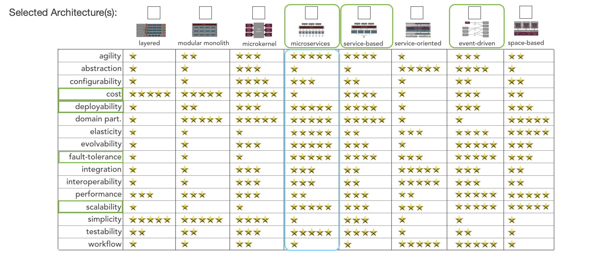

# Architecture Analysis

## Key Non-functional Properties

The following section contains the key non-functional properties of the architecture:

#### Scalability/Elasticity

Number of users which might want to use the HeyBlue App in the Unites States:

Police Officers: 6,60,288 ([source](https://www.statista.com/statistics/191694/number-of-law-enforcement-officers-in-the-us/))

Civilians: 332 million (source: )

Charities: 1.5 million ([source](https://www.nptrust.org/philanthropic-resources/charitable-giving-statistics/#:~:text=According%20to%20the%20most%20recent,organizations%20in%20the%20United%20States.))

Online Retail Stores: 1.8 million ([source](https://www.nptrust.org/philanthropic-resources/charitable-giving-statistics/#:~:text=According%20to%20the%20most%20recent,organizations%20in%20the%20United%20States.))

If police officers across the United States simply connected with 5 community members per day, the result would be 1.2 BILLION connections in a year.

And these numbers are only for the Unites States. This gives us an indication that we are dealing with a very large user base (who will all interact with one another in the HeyBlue App). So our architecture needs to scale to meet these numbers.

#### Resiliency/Fault-Tolerance

Since our application will be fairly complex due to complex relationships among its users (police officers, civilians, charities, retail stores, third-party social media sites), resiliency is a key concern for  identifying and resolving performance issues which may arise due to level of complexity in our application.

#### Deployability

Keeping in mind DevOps philosophy and the agile approach, modern applications need to be developed, tested, and deployed continuosly to quickly add new features and reduce troubleshooting turnaround times. Our application would also benefit from easier and efficient deployment.

## Additional Considerations

#### Usability

Usability is one of the key requirements for our HeyBlue App, since the users of the app are regular civilians and police officers who may have limited experience with technology. Hence our architecture should focus on ease of use to drive more engagement and serve the business needs of the application.

#### Security

Security is a key concern for our application, since it involves tracking the physical location of civilians and police officers to be able to connect them, and also securing soem PII such as names, official email addresses of police officers, and valuable points collected through connections.

#### Cost

Our application would be developed by a non-profit organization, which may have limited resources and funds at their disposal, hence cost is also a factor for our architecture.

## Architecture Styles

Using the analysis of the key non-functional properties above and with the help of  the [worksheet](https://www.developertoarchitect.com/downloads/architecture-styles-worksheet.pdf), we compared a few styles and finalized one that will give us the most benefits with respect to the non-functional properties above. 

As shown in the table, Microservices, Service-based and event-based architectures were the most suitable candidates. We selected Microservices to be the architectural style for this application, since it satisfied all the three key non-functional properties will highest ratings.

The detailed choice of Microservices architecture is documented in [ADR: MICROARCH](./../ADRs/MICROARCH.md).
