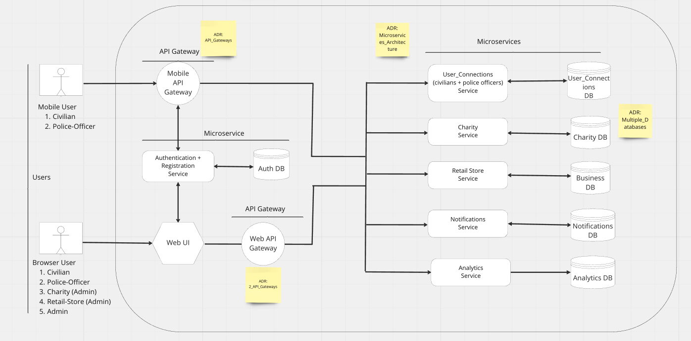

# High Level Architecture

The high level architecture incorporates the key characteristics mentioned in architecture analysis:

## API Gateways

API gateways provide ability to route requests from users to backend microservices, and provide other useful features such as rate-limiting, caching, DDoS protection etc.

## Backend Microservices

Backend microservices implement business use-cases for the application, through loose coupling between them. 