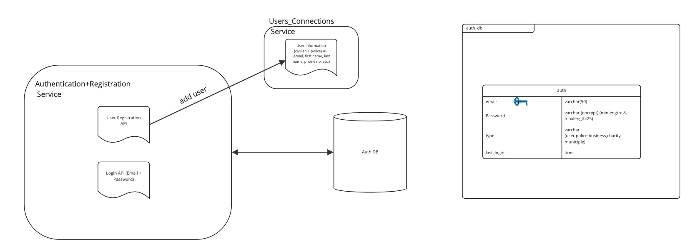

# Authentication & Registration

## Diagram

## Description

Authentication & Registration Service is responsible for authenticating users, and registering new users. It also enforces role based access control, RBAC information is stored in the session token. It also interacts with "User_Connections" service and uses "auth db" as a database to store user credentials.

## Use Cases

1. User Profile Creation
2. User Authentication

