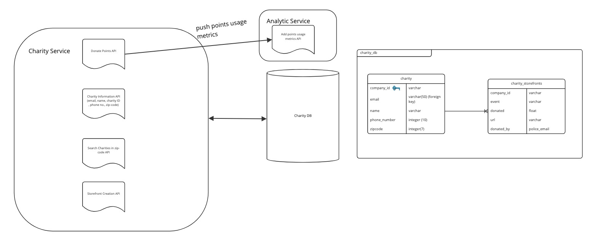

# Charity Service

## Diagram

## Description

Charity Service is responsible for charity's metadata, storefront creation to enable points for donation from users to charities. It also interacts with "Analytics" service and uses "charity db" to store information about charities.

## Use Cases

1. Storing charity data 
2. Enable users to donate points to charities
3. Create charity events (storefront) 