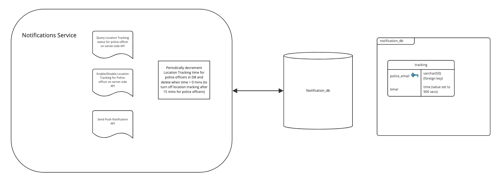

# Notification Service

## Diagram

## Description

Notification Service is responsible for managing notifications based on user's location and settings. It uses "notification db" to store information police-officers location.

## Use Cases

1. Location tracking 
2. Push notifications to users
3. Enable/Disable location tracking for police-officers 