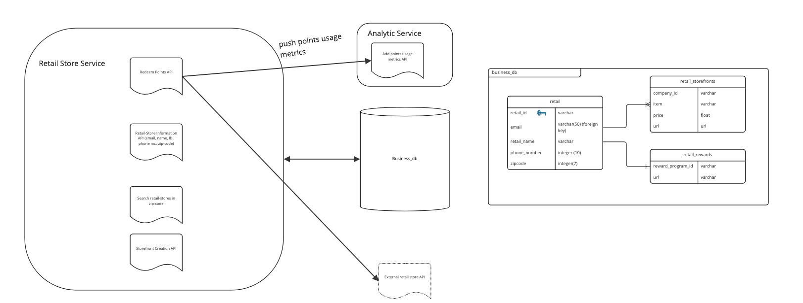

# Retail Store Service

## Diagram

## Description

Retail Store Service is responsible for business's metadata, storefront creation to redeem points for goods/services. It also enables businesses to integrate rewards program within HeyBlue application. It also interacts with "Analytics" service and uses "business db" to store information about businesses.

## Use Cases

1. Storing business's data 
2. Enable users to redeem points
3. Add business reward integration