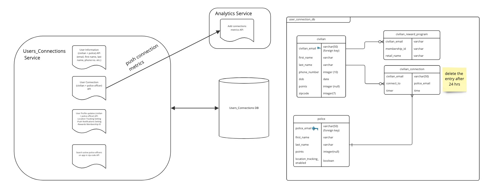

# Users_Connections Service

## Diagram

## Description

Users_Connection Service is responsible for user's metadata, enabling connections between civilians and police officers and points tracking for civilians and police-officers. It also interacts with "Analytics" service and uses "users_connections db" to store information about users and connections.

## Use Cases

1. Storing user data 
2. Enabling connections
3. Points tracking 

