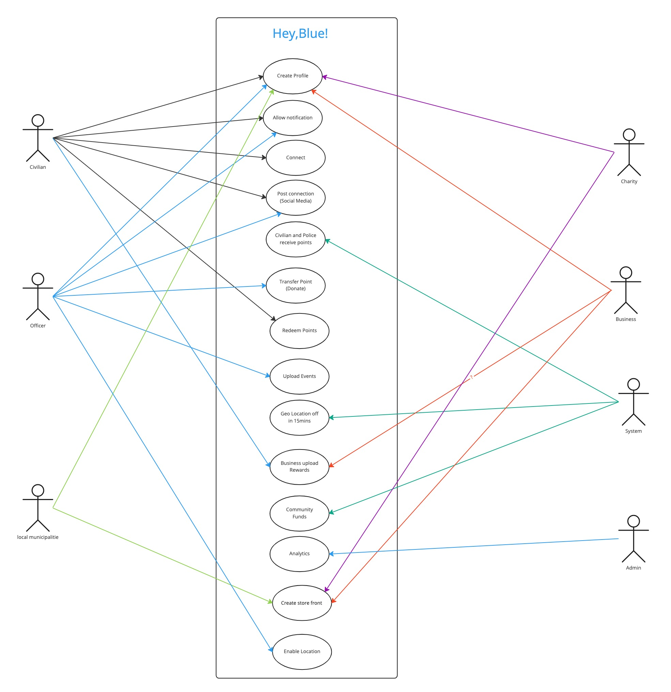
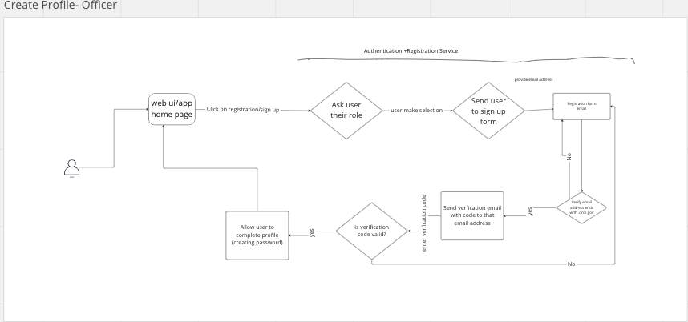
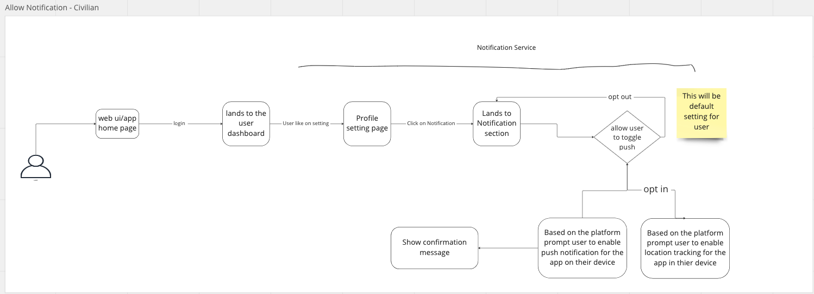
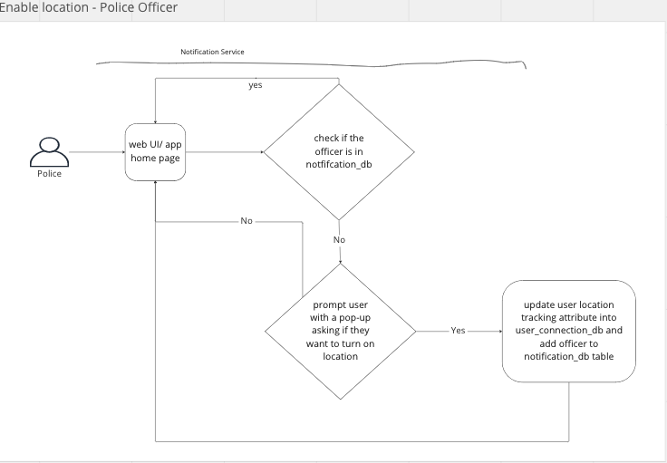

# Actors, Actions, and Significant Scenarios

We have created a use case diagram that give a summarize version on all the actors assciated in this app and all the actions they will perform.

## Important workflows

This section will expand on the use case diagram and will explore each individual actions by the actor(s).

### Create Profile

#### Officer

#### Civilian

#### Charity, Business, and Municipal

### Allow Notification

#### Officer

#### Civilian

### Connect
#### Civilian

### Post Connection (Social Media

#### Civilian and Officer

### Upload Rewards Program 

#### Civilian

#### Business upload Rewards
add diagram

### Transfer Points (Donote)

#### Officer

### Redeem Points
need diagram

### Upload Events

### Officer

### Geo Location off (15 mins)

#### System

### Community Funds

#### System

### Analytics

#### Admin

### Create Store front

#### Business, Charity, and Municipal
This flow is part of Create Profile - Charity, Business, and Municipal

### Enable Location

#### Officer

